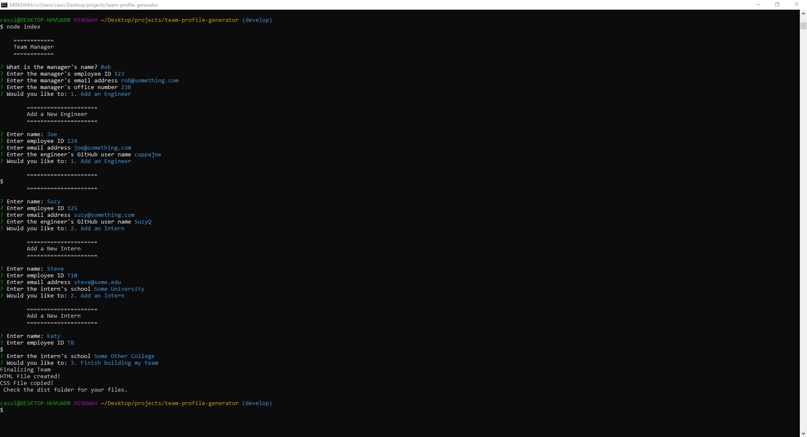
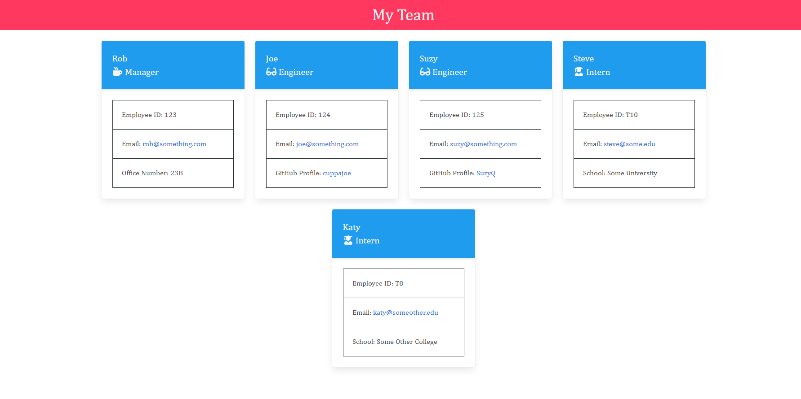

# Team Profile Generator
This application allows a user to generate an HTML page with a visual representation of their team, similar to an org chart, with contact information. The manager has an office location listed, engineers have links to their GitHub profiles, and interns have their school listed.  All three have a linked email address on their contact card.  

## Tools Used to Create This Project
* JavaScript ES5 and ES6
* Node.js
* npm inquirer for the command line prompts
* npm jest for testing the employee classes and methods used in creating the page

## Installation Instructions
* Clone the repository to your computer
* In the directory where you have the project saved, make sure you have the required dependencies installed. Depending on your current setup, you might need to:
    * Install Node.js from [their website](https://nodejs.org/en/)
        * The default settings are acceptable
    * Initialize npm 
        * type `npm init` in your command line
    * Install the inquirer package from [npm](https://www.npmjs.com/package/inquirer)
        * type `npm install inquirer`
* If you would like to review the tests, you will need to install Jest
    * Type `npm install jest`
    * Type `npm run test` to run the suite of tests, or you can add on the specific test suite to see the individual tests for that module, e.g. `npm run test Employee` to see the list of tests for the Employee constructor

## Usage
* From the command line in the directory with this project, type `node index` to run the program
* Enter information for the team manager
* Select if you would like to add an engineer, add an intern, or finalize your team
* Enter information for each team member
* When finished, select `Finish building my team` to finalize the team members and create the html page.  You can view the created page in the `dist` folder along with a copied CSS style sheet.  The two files can then be copied to the desired location on the computer or uploaded to a server. 

## Screenshots

## Video Walkthrough
* This video walkthrough demonstrates the test suite and the functionality of the application. 
https://drive.google.com/file/d/1tFtHB7UCbmR80NmoEPyNIXYglgIqx97p/view?usp=sharing
